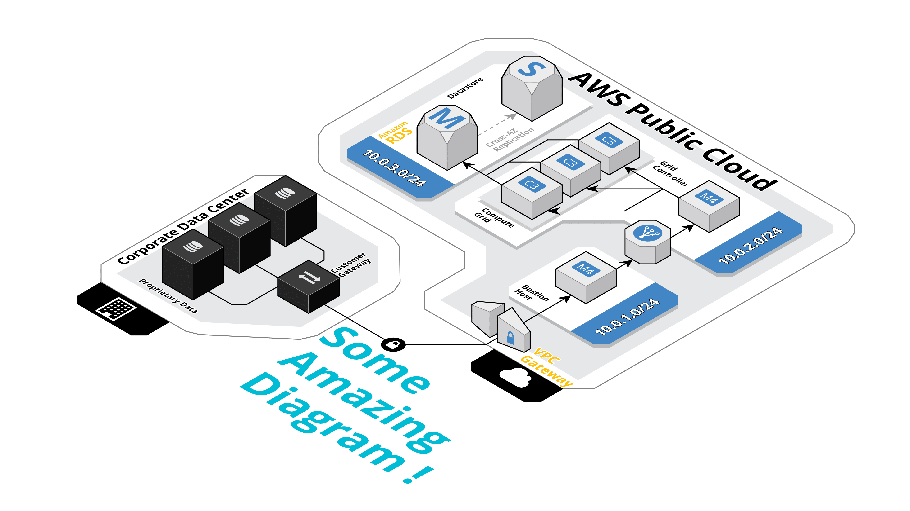

# devops-pipeline-terraform-mod-example

[](https://www.terraform.io)
[](https://www.terraform.io)

>Terraform module responsible for the creation of resources related to some Amazing Terraform Module
>
>Developed with all :heart: in the world by ADL DevOps team

## Table of Contents

- [devops-mod-provider-name](#devops-mod-provider-name)
  - [Table of Contents](#Table-of-Contents)
  - [Prerequisites](#Prerequisites)
  - [Inputs](#Inputs)
  - [Outputs](#Outputs)
  - [Diagram](#Diagram)
  - [Example usage](#Example-usage)
  - [Contributing](#Contributing)
  - [Further Reading / Useful Links](#Further-Reading--Useful-Links)

## Prerequisites

You will need the following things properly installed on your computer.

* [Git](http://git-scm.com/)
* [Terraform](https://www.terraform.io/downloads.html)


## Inputs

| Name | Description | Type | Default | Required |
|------|-------------|:----:|:-----:|:-----:|
| input_variable_name | All input variables declaration in the current terraform module | map  | {} | yes |
| tags | The map of Tags to attach to Resources | map | n/a | yes |

## Outputs

| Name | Description |
|------|-------------|
| output_name | All outputs declaration in the current terraform module |
| iam\_policy\_dynamodb\_r | The arn of the reading IAM policy |
| iam\_policy\_dynamodb\_rw | The arn of the reading-writing IAM policy |

## Diagram



## Example usage

```terraform
# An example related to how to use this amazing terraform module
module "dynamodb_analytics" {
  source                 = "git@github.com:avaldigitallabs/devops-mod-aws-dynamodb.git?ref=v0.11-5"
  name                   = "lambda-analytics"
  name_prefix            = "${var.dynamodb_name_prefix}"
  hash_key               = "timestamp"
  hash_key_type          = "N"
  stack_id               = "${var.stack_id}"
  point_in_time_recovery = "${local.dynamo_time_recovery}"
  tags                   = "${local.common_tags}"

  additional_attributes = [
    {
      name = "bank"
      type = "S"
    },
  ]

  global_secondary_index = [
    {
      hash_key        = "bank"
      name            = "bank-timestamp-index"
      projection_type = "ALL"
      range_key       = "timestamp"
    },
  ]
}
```

## Contributing

If you find this repo useful here's how you can help:

1. Send a Pull Request with your awesome new features and bug fixes
2. Wait for a Coronita :beer: you deserve it.

## Further Reading / Useful Links

* [Terraform Docs](https://www.terraform.io/docs/index.html)
* [Terraform modules](https://www.terraform.io/docs/modules/usage.html)
* [Terraform Guides](https://www.terraform.io/guides/index.html)
